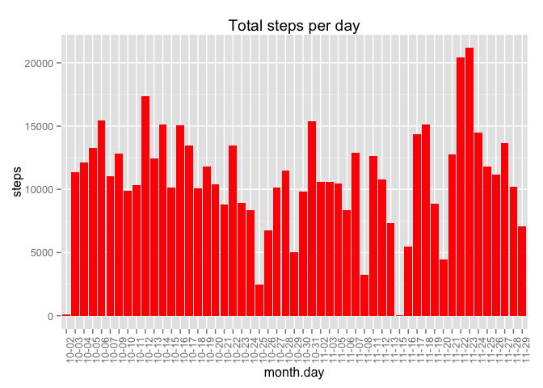
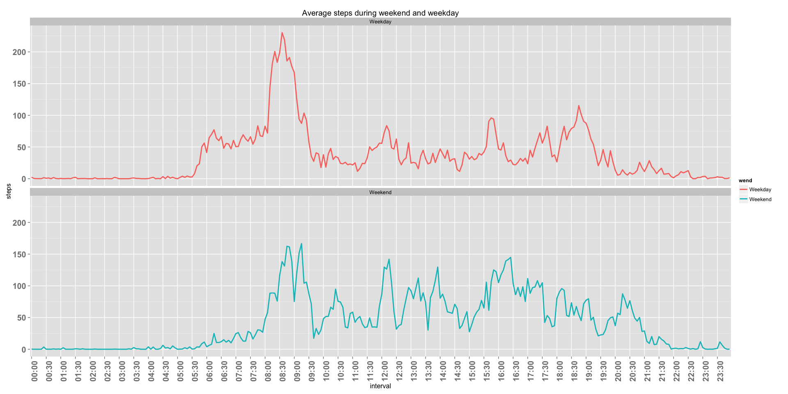

# Reproducible Research: Peer Assessment 1


## Loading and preprocessing the data

```r
data = read.csv("activity.csv")
intervals  <- strptime(sprintf("%04d", data[,3]), "%H%M")
interval  <- format(intervals, format ="%H:%M")
dateofData = as.Date(data[,2], format ="%Y-%m-%d")
monthdayofData  <- format(dateofData, "%m-%d")
dayofData  <- weekdays(dateofData, abbreviate = TRUE)
data[,c(2:5)]  <-  cbind(as.character(dateofData), interval,monthdayofData, dayofData)
names(data)[4]  <- cbind("month.day")
names(data)[5]  <- "weekday"
head(data)
```

```
##   steps       date interval month.day weekday
## 1    NA 2012-10-01    00:00     10-01     Mon
## 2    NA 2012-10-01    00:05     10-01     Mon
## 3    NA 2012-10-01    00:10     10-01     Mon
## 4    NA 2012-10-01    00:15     10-01     Mon
## 5    NA 2012-10-01    00:20     10-01     Mon
## 6    NA 2012-10-01    00:25     10-01     Mon
```

```r
data_noMissing  <- data[!is.na(data$steps),]
```

## What is mean total number of steps taken per day?
Ignoring the missing part of data for this analysis

```r
library("reshape2")
library("ggplot2")
temp  <- melt(data[,c(1,4)], id = "month.day", measure.vars = "steps", na.rm = TRUE)
meanStepsDay  <- dcast(temp, month.day~variable, mean)
totalStepsDay  <- dcast(temp, month.day~variable, sum)
medianStepsDay  <-sapply(split(data_noMissing$steps,data_noMissing$date), median)
# Plot total number of steps in a particular day of a month
c  <- ggplot(totalStepsDay , aes(x =month.day, y = steps))
c + geom_bar(stat ="identity", fill = "red")+theme(axis.text.x = element_text(angle = 90, hjust = 1)) + labs(title = "Total steps per day")
```

 

```r
hist(totalStepsDay $steps, xlab = "Number of steps", main = "Frequency of total no of steps each day")
```

 

```r
# print median and mean steps per day
cbind(meanSteps = meanStepsDay$steps, medianSteps = medianStepsDay)
```

```
##            meanSteps medianSteps
## 2012-10-02    0.4375           0
## 2012-10-03   39.4167           0
## 2012-10-04   42.0694           0
## 2012-10-05   46.1597           0
## 2012-10-06   53.5417           0
## 2012-10-07   38.2465           0
## 2012-10-09   44.4826           0
## 2012-10-10   34.3750           0
## 2012-10-11   35.7778           0
## 2012-10-12   60.3542           0
## 2012-10-13   43.1458           0
## 2012-10-14   52.4236           0
## 2012-10-15   35.2049           0
## 2012-10-16   52.3750           0
## 2012-10-17   46.7083           0
## 2012-10-18   34.9167           0
## 2012-10-19   41.0729           0
## 2012-10-20   36.0938           0
## 2012-10-21   30.6285           0
## 2012-10-22   46.7361           0
## 2012-10-23   30.9653           0
## 2012-10-24   29.0104           0
## 2012-10-25    8.6528           0
## 2012-10-26   23.5347           0
## 2012-10-27   35.1354           0
## 2012-10-28   39.7847           0
## 2012-10-29   17.4236           0
## 2012-10-30   34.0938           0
## 2012-10-31   53.5208           0
## 2012-11-02   36.8056           0
## 2012-11-03   36.7049           0
## 2012-11-05   36.2465           0
## 2012-11-06   28.9375           0
## 2012-11-07   44.7326           0
## 2012-11-08   11.1771           0
## 2012-11-11   43.7778           0
## 2012-11-12   37.3785           0
## 2012-11-13   25.4722           0
## 2012-11-15    0.1424           0
## 2012-11-16   18.8924           0
## 2012-11-17   49.7882           0
## 2012-11-18   52.4653           0
## 2012-11-19   30.6979           0
## 2012-11-20   15.5278           0
## 2012-11-21   44.3993           0
## 2012-11-22   70.9271           0
## 2012-11-23   73.5903           0
## 2012-11-24   50.2708           0
## 2012-11-25   41.0903           0
## 2012-11-26   38.7569           0
## 2012-11-27   47.3819           0
## 2012-11-28   35.3576           0
## 2012-11-29   24.4688           0
```
## What is the average daily activity pattern?
### Removing NA values from the analysis

```r
library("reshape2")
temp  <- melt(data[,c(1,3)], id = "interval", measure.var = "steps", na.rm = TRUE)
stepsOverInterval  <- dcast(temp, interval~variable, mean)
# Plot average number of steps for each interval
my_breaks <- interval[seq(1, length(interval), 30)]
c <- ggplot(stepsOverInterval, aes(x = interval, y = steps, col = "red")) 
c+ geom_line(aes(group = 1), size = 1)+theme(axis.text.x = element_text(angle = 90, hjust = 1.5, size = 15, face = "bold"))+ labs(title = "Average number of steps over each 5 min interval")+scale_colour_manual(values=c("red"),labels=c("Average_Activity"))+labs(colour = "steps")+scale_x_discrete(breaks=my_breaks) +theme(axis.text.y = element_text(size = 15, face="bold"))
```

 

```r
intervalMaxSteps  <- stepsOverInterval[which.max(stepsOverInterval[,2]),1]
```
Interval 08:35 (hr:min) has the maximum number of average steps. The maximum averaged steps are 206.1698.

## Imputing missing values
### Replaced missing values by mean over that interval

```r
numNA  <- sum(is.na(data[,1]))
# replace missing values by mean
for(i in 1:dim(data)[1])
  {
  if (is.na(data$steps[i]))
    {
    actInterval  <-  data$interval[i]
    intervalMean  <- stepsOverInterval[stepsOverInterval$interval == actInterval,2]
    data$steps[i]  <- intervalMean
    }
  }

nData  <- read.csv("activity.csv")
nData$steps  <- data$steps
head(nData)
```

```
##     steps       date interval
## 1 1.71698 2012-10-01        0
## 2 0.33962 2012-10-01        5
## 3 0.13208 2012-10-01       10
## 4 0.15094 2012-10-01       15
## 5 0.07547 2012-10-01       20
## 6 2.09434 2012-10-01       25
```

```r
# Histogram of total numver of steps each day
temp  <- melt(data[,c(1,4)], id = "month.day", measure.vars = "steps")
totalStepsDay  <- dcast(temp, month.day~variable, sum)
meanStepsDay  <- dcast(temp, month.day~variable, mean)
medianStepsDay  <-na.omit(sapply(split(data$steps,data$month.day), median))
# Plot total number of steps in a particular day of a month
c  <- ggplot(totalStepsDay, aes(x =month.day, y = steps))
c + geom_bar(stat ="identity", fill = "red")+theme(axis.text.x = element_text(angle = 90, hjust = 1)) + labs(title = "Total steps per day")
```

 

```r
hist(totalStepsDay$steps, xlab = "Number of steps", main = "Frequency of total no of steps each day")
```

 

```r
cbind(meanStepsDay, medianStepsDay)
```

```
##       month.day   steps medianStepsDay
## 10-01     10-01 37.3826          34.11
## 10-02     10-02  0.4375           0.00
## 10-03     10-03 39.4167           0.00
## 10-04     10-04 42.0694           0.00
## 10-05     10-05 46.1597           0.00
## 10-06     10-06 53.5417           0.00
## 10-07     10-07 38.2465           0.00
## 10-08     10-08 37.3826          34.11
## 10-09     10-09 44.4826           0.00
## 10-10     10-10 34.3750           0.00
## 10-11     10-11 35.7778           0.00
## 10-12     10-12 60.3542           0.00
## 10-13     10-13 43.1458           0.00
## 10-14     10-14 52.4236           0.00
## 10-15     10-15 35.2049           0.00
## 10-16     10-16 52.3750           0.00
## 10-17     10-17 46.7083           0.00
## 10-18     10-18 34.9167           0.00
## 10-19     10-19 41.0729           0.00
## 10-20     10-20 36.0938           0.00
## 10-21     10-21 30.6285           0.00
## 10-22     10-22 46.7361           0.00
## 10-23     10-23 30.9653           0.00
## 10-24     10-24 29.0104           0.00
## 10-25     10-25  8.6528           0.00
## 10-26     10-26 23.5347           0.00
## 10-27     10-27 35.1354           0.00
## 10-28     10-28 39.7847           0.00
## 10-29     10-29 17.4236           0.00
## 10-30     10-30 34.0938           0.00
## 10-31     10-31 53.5208           0.00
## 11-01     11-01 37.3826          34.11
## 11-02     11-02 36.8056           0.00
## 11-03     11-03 36.7049           0.00
## 11-04     11-04 37.3826          34.11
## 11-05     11-05 36.2465           0.00
## 11-06     11-06 28.9375           0.00
## 11-07     11-07 44.7326           0.00
## 11-08     11-08 11.1771           0.00
## 11-09     11-09 37.3826          34.11
## 11-10     11-10 37.3826          34.11
## 11-11     11-11 43.7778           0.00
## 11-12     11-12 37.3785           0.00
## 11-13     11-13 25.4722           0.00
## 11-14     11-14 37.3826          34.11
## 11-15     11-15  0.1424           0.00
## 11-16     11-16 18.8924           0.00
## 11-17     11-17 49.7882           0.00
## 11-18     11-18 52.4653           0.00
## 11-19     11-19 30.6979           0.00
## 11-20     11-20 15.5278           0.00
## 11-21     11-21 44.3993           0.00
## 11-22     11-22 70.9271           0.00
## 11-23     11-23 73.5903           0.00
## 11-24     11-24 50.2708           0.00
## 11-25     11-25 41.0903           0.00
## 11-26     11-26 38.7569           0.00
## 11-27     11-27 47.3819           0.00
## 11-28     11-28 35.3576           0.00
## 11-29     11-29 24.4688           0.00
## 11-30     11-30 37.3826          34.11
```

### Observations
Number of missing values (NA) = 2304.
Mean and median Values differ from the estimates when NA values were not removed. Mean values changes signficantly after filling the missing values however median for most of the cases is still zero which might be due to large number of zeros in the data. Having a zero means that the person did not do any activitity during these intervals (e.g. sleeping)

## Are there differences in activity patterns between weekdays and weekends?

```r
data$wend<- as.factor(ifelse(data$weekday %in% c("Sat","Sun"), "Weekend", "Weekday")) 
temp  <- melt(data[,c(1,3,6)], measure.var ="steps", id = c("wend", "interval"))
weekSteps  <- dcast(temp, wend+interval~variable, mean)
g  <- ggplot(weekSteps, aes(interval, steps, color = wend))
g+geom_line(aes(group = wend), size = 1) +labs(title = "Average steps during weekend and weekday")+theme(axis.text.x = element_text(angle = 90, hjust = 1, size = 15, face = "bold"))+facet_grid(wend~.)+scale_x_discrete(breaks=my_breaks)+theme(axis.text.y = element_text(size = 15, face="bold"))
```

 
